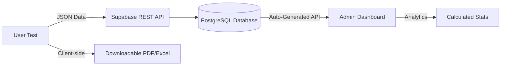

# Lexical Decision Task - Technology Research Report

## 1. Recommended Stack Summary

| Component | Technology | Why? |
| :--- | :--- | :--- |
| **Frontend** | **React (Vite)** | Excellent for millisecond-precision timing and state management. |
| **Backend** | **Supabase (BaaS)** | Provides instant REST/GraphQL APIs and Auth without server management. |
| **Database** | **PostgreSQL (Supabase)** | Robust, scales well, and fits the "Excel-like" table requirement. |
| **Auth** | **Supabase Auth** | Built-in authentication (Email/Magic Links) for the Admin Dashboard. |
| **Hosting** | **Vercel** | Fast global CDN, seamless CI/CD, and generous free tier for static/React apps. |
| **Export** | **jsPDF / SheetJS** | Client-side libraries for generating PDF/Excel reports for free. |

---

## 2. Detailed Component Analysis

### Frontend: React with Vite
*   **Precision Timing:** React's hooks (`useRef`, `perfomance.now()`) allow for high-accuracy reaction time measurement (±1ms), critical for cognitive tasks.
*   **Vite:** Faster development and build cycles compared to CRA.
*   **Tailwind CSS:** Rapid, responsive UI development for both the test and the Admin Dashboard.

### Backend & Database: Supabase (PostgreSQL)
*   **Zero Cost:** The free tier includes 500MB database, which is enough for thousands of test results.
*   **Serverless:** No need to write/maintain a separate Node.js server; Supabase generates APIs automatically from your table schema.
*   **Real-time Capabilities:** Can be used to update the Admin Dashboard in real-time as users finish tests.

### Hosting: Vercel
*   **Global Distribution:** Ensures low latency for users worldwide.
*   **Hobby Plan:** $0 for unlimited personal projects with 100GB bandwidth/month.
*   **Edge Functions:** If complex server-side logic is needed later, Vercel's edge functions provide it for free.

---

## 3. Data Flow Architecture

1.  **Submission:** When the user finishes, React collects `response_times` and `correctness`.
2.  **Persistence:** Data is sent via `supabase-js` directly to the `results` table.
3.  **Authentication:** Admins log into the `/admin` route via Supabase Auth.
4.  **Aggregation:** The Admin Dashboard fetches all rows from Supabase and performs client-side (or via Postgres Views) average calculations for the "Analytics Section".

---

## 4. Potential Limitations

*   **Supabase Inactivity:** Free projects are paused after 1 week of inactivity. (Need to visit the dashboard once a week or use a simple uptime monitor).
*   **Vercel Hobby Limits:** 100GB bandwidth and 6,000 build minutes per month. Highly sufficient for an educational tool.
*   **Database Size:** 500MB limit. For text-based lexical data, this could store roughly 50,000+ detailed test results.
*   **Auth:** Supabase Free Tier allows up to 50,000 Monthly Active Users (MAU), which is massive for this scope.
